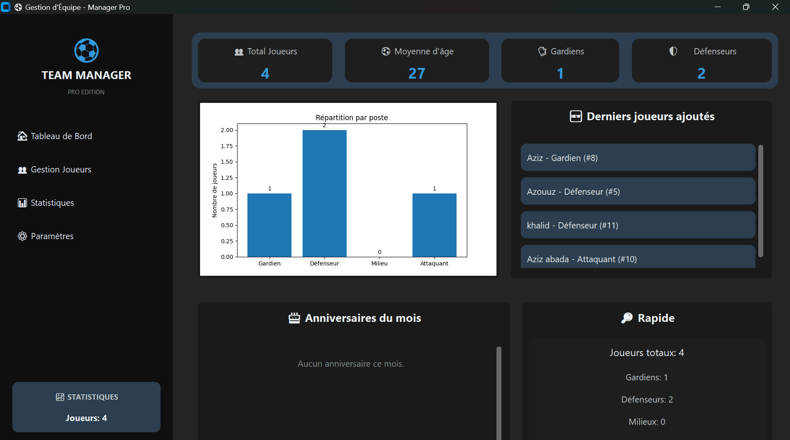
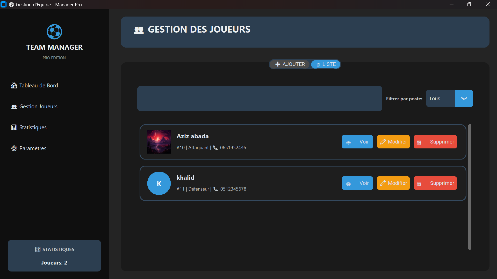

# Team Manager Pro


Une application moderne de gestion d'équipe sportive développée avec
Python et CustomTkinter, offrant une interface utilisateur élégante et
intuitive pour gérer efficacement vos joueurs.

## Fonctionnalités

### Gestion Complète des Joueurs

-   Ajout de joueurs avec formulaire détaillé
-   Modification des informations existantes
-   Suppression sécurisée avec confirmation
-   Recherche et filtrage par poste
-   Visualisation des détails en mode modal

### Gestion des Photos

-   Upload et prévisualisation des photos de profil
-   Stockage sécurisé dans un dossier dédié
-   Affichage avec cadres circulaires modernes
-   Support PNG, JPG, JPEG, GIF, BMP

### Gestion des Données

-   Sauvegarde automatique en JSON
-   Chargement au démarrage
-   Backup des images
-   Intégrité des données préservée

### Interface Moderne

-   Thème sombre professionnel
-   Design responsive
-   Animations et effets visuels
-   Navigation intuitive
-   Sidebar dynamique

## Installation

### Prérequis

-   Python 3.8 ou supérieur
-   pip installé

### Installation

``` bash
git clone https://github.com/votre-username/team-manager-pro.git
cd team-manager-pro
pip install -r requirements.txt
```

### Dépendances principales

``` text
customtkinter>=5.2.0
pillow>=10.0.0
```

## Utilisation

### Démarrer l'application

``` bash
python team_manager.py
```

### Guide rapide

1.  Onglet  AJOUTER → remplir → ajouter photo → SAUVEGARDER\
2.  Onglet  LISTE → recherche + filtres\
3.  Bouton  Modifier → modifier → sauvegarder\
4.  Bouton  Voir pour la fiche détaillée\
5.  Bouton  Supprimer → confirmation

##  Structure du Projet

    team-manager-pro/
    │
    ├── team_manager.py
    ├── requirements.txt
    ├── README.md
    ├── team_data.json
    └── player_images/
        ├── player_1.jpg
        ├── player_2.png
        └── ...

##  Développement

### Architecture MVC simplifiée

-   Modèles : `Player`
-   Vues : `ModernTeamManagementSystem`, `ModernPlayerModal`
-   Contrôleur : logique intégrée

### Personnalisation des couleurs

``` python
self.colors = {
    "primary": "#3498db",
    "secondary": "#2c3e50",
    "success": "#27ae60",
    "danger": "#e74c3c",
    "warning": "#f39c12",
    "dark": "#1a1a1a",
    "darker": "#0f0f0f"
}
```

### Ajouter des postes

``` python
postes = ["Gardien", "Défenseur", "Milieu", "Attaquant", "Capitaine"]
```

## 📸 Captures d'écran



##  Fonctionnalités Techniques

### Gestion des erreurs

-   Validation des champs
-   Erreurs de chargement d'image
-   Sauvegarde sécurisée

### Performance

-   Interface non-bloquante
-   Chargement lazy des images
-   Scrollbars optimisés

### Sécurité

-   Validation input
-   Gestion sécurisée des chemins
-   Confirmations pour actions critiques

## Contribution

1.  Fork le projet\
2.  Créer une branche : `feature/AmazingFeature`\
3.  Commit : `git commit -m "Add AmazingFeature"`\
4.  Push : `git push origin feature/AmazingFeature`\
5.  Ouvrir une pull request

##  Roadmap

-   [ ] Export PDF des fiches
-   [ ] Statistiques avancées
-   [ ] Calendrier des matchs
-   [ ] Gestion blessures
-   [ ] Module communication
-   [ ] Sync cloud

## 🐛 Dépannage

### L'application ne se lance pas

-   Vérifier Python 3.8+
-   Réinstaller les dépendances
-   Vérifier les permissions

### Les images ne s'affichent pas

-   Vérifier formats supportés
-   Vérifier permissions dossier
-   Vérifier espace disque

### Erreur de sauvegarde

-   Vérifier permissions
-   Vérifier si un autre programme bloque le fichier


## Auteur

Développé avec par **Abada aziz**

##  Remerciements

-   CustomTkinter\
-   Pillow\
-   Communauté Python

------------------------------------------------------------------------

**Merci de laisser une étoile au projet !**
